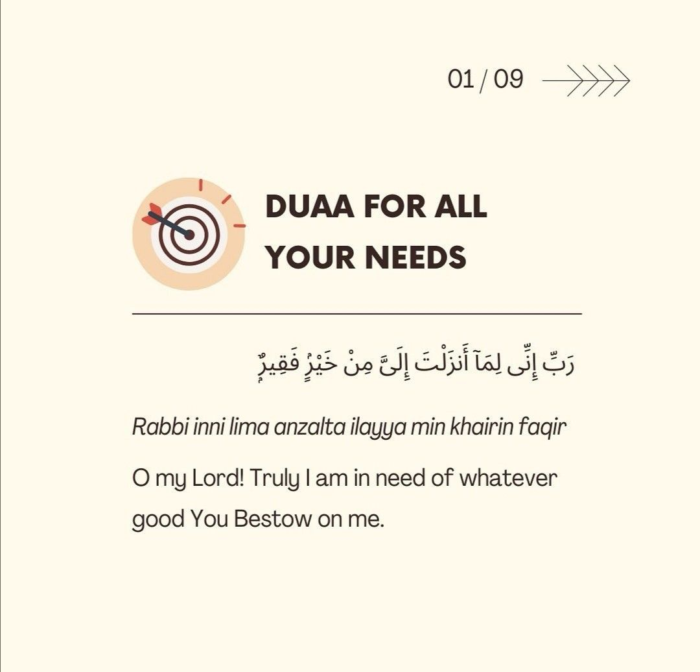
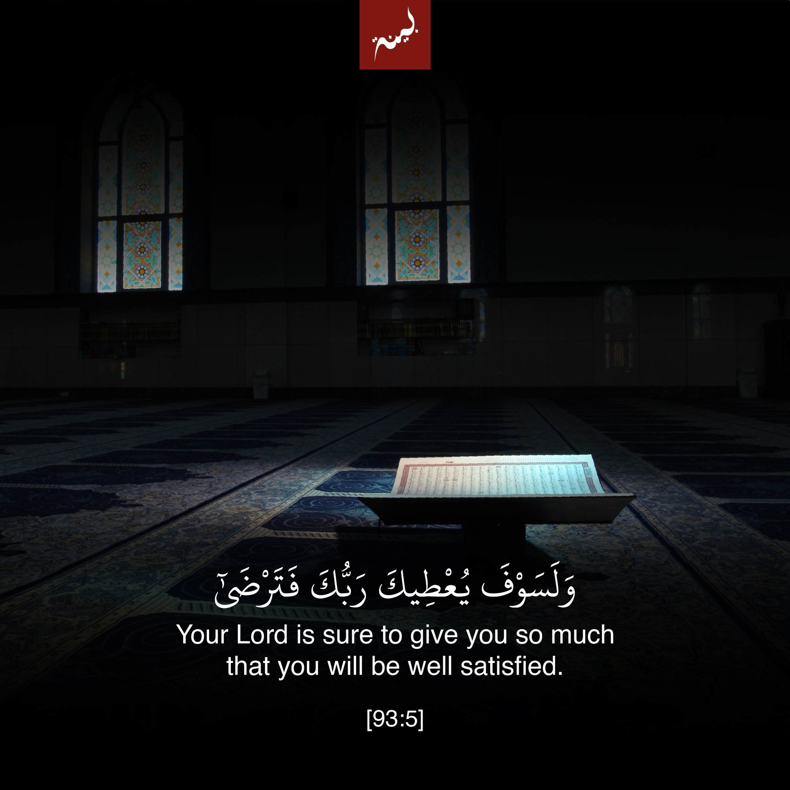

 

  

<h2 align="center">Assalam U Alaikum !,👋  I am <strong>Syed Muhammad Arsalan Shah.</strong>  

I have been teaching multiple IT skills in Aptech Gulshan II.

I have completed three year Diploma in IT and one year course of Application Development. Currently, I am enrolled in the graduation degree of BS in Islamic Studies with Computer Technology  along with Aalim course 8th year. 
✍
 
 
</h2>

 

<h2 align="center">📖 Best Quranic Duas & Motivational Ayahs</h2>

 

 
<h2 align="center">📖  الرقية الشرعية | الشيخ مشاري راشد العفاسي || Mishary Alafasy Ruqiah </h2>

https://github.com/SyedMuhammadArsalanShah/SyedMuhammadArsalanShah/assets/77351219/81598e39-09b9-4f1f-9a90-0343f2955bca

 

 

<h2 align="center">🚀 Professional Skills</h2>

 

  
  
  
  
  
  
  
  
  
  
  
  
  
  
  
  
  
  
  
  
  
  
  
  
  
  
  
  
  
  
  
  
  
  

###

 
<h2 align="center">📱 Islamic Insights Hub</h2>
 

  
### Project Overview
**Duration:** Nov 2023 - Dec 2023  
**Affiliation:** Sheikh Zayed Islamic Center, University of Karachi

**Features:**
- 📖 Read the entire Quran
- 🔍 Search Quranic Verses by user-friendly Urdu keyboard 
- 📖 Explore 9 Authentic Hadith Collections
- 🔍 Search Hadith by Number, Arabic, Urdu, English

**Tech:** Flutter, API-based architecture

**Source Code** <a href="https://github.com/SyedMuhammadArsalanShah/Islamic-Insights-Hub-Application/" target="_blank">Islamic-Insights-Hub-Application</a>

**Contact:** [Islamic Insights Hub](mailto:smarsalanshah125@gmail.com)

**Video Presentation:** [Watch Video Presentation](https://youtu.be/SVu7d4OCWQM?si=BVLTXRhTuVFdF6EA)

https://github.com/SyedMuhammadArsalanShah/SyedMuhammadArsalanShah/assets/77351219/5bd3cd95-e51d-49db-8899-78d79151cacf

 

<h2 align="center">🌐 Connect With Me</h2>

###

 

  
<!--   <a href="https://wa.me/923032006225" target="_blank"> -->

  
  
  
  

###

 

<h2 align="center"> 📈 My GitHub Insights 📊</h2>

 

  
  
  
  

###

<!-- 

  
 
  

 -->

